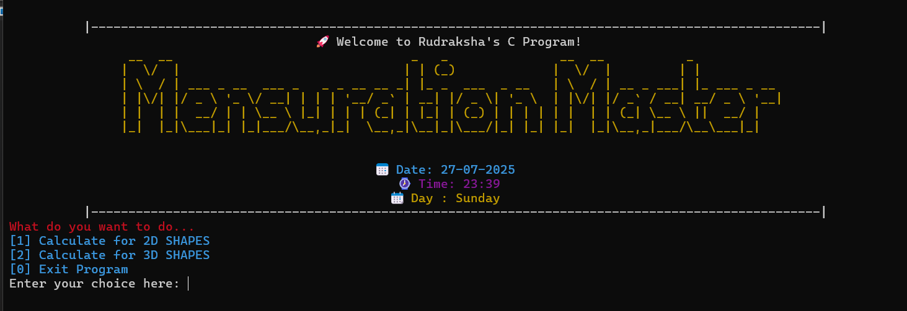
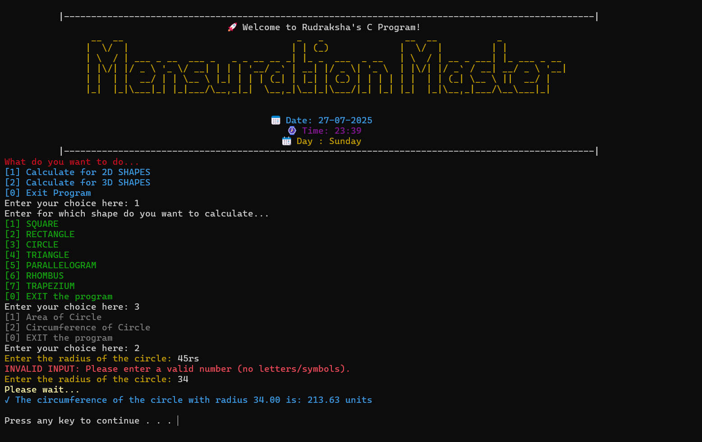
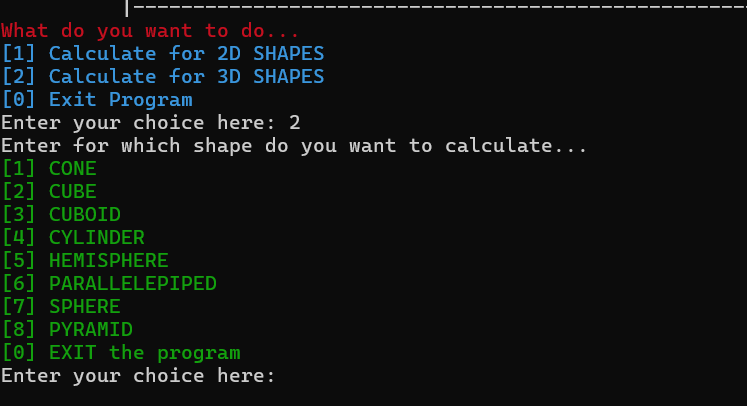
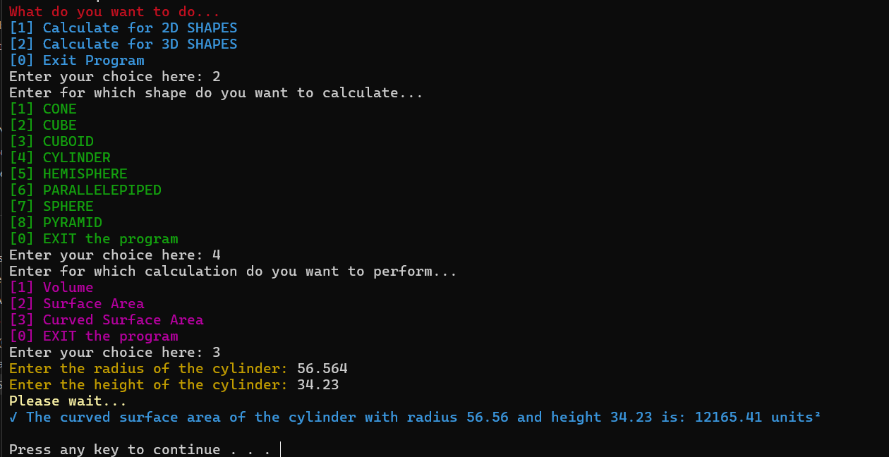
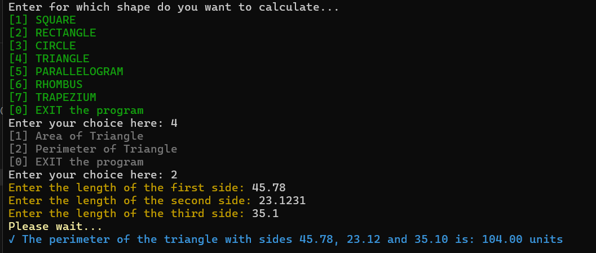

# 📐 Mensuration Master


## _A C-based Geometry Calculator for Students, Educators, and Developers_

<b>Mensuration Master</b> is a modular, <u>terminal-based application</u> written in C for calculating <b>area</b>,<b> perimeter</b>, and <b>volume</b> of 2D and 3D geometric shapes. Built with a strong focus on input validation, readability, and user-friendly interface, this project is ideal for high school/college students, beginner programmers, and anyone needing a clean mensuration tool.

## 🚀 Key Features

- 🔢 Calculates area, perimeter, and volume of common 2D and 3D shapes

- ✅ Strong input validation (blocks alphabets, symbols, and negative values)

- 🎨 Color-coded terminal output using ANSI escape sequences

- ⚙️ Modular file structure with reusable components

- 🗂️ Supports shapes like Square, Rectangle, Circle, Triangle, Trapezium, Cone, Cube, Sphere, etc.

- 🕒 Dynamic date, time, and day banner on program startup

- 🧼 Cross-platform screen clear and pause support

## 🖼️ Screenshots

### Main Interface



### Secondary View / Feature

<p align="center">
  
  
  <br>
  
  
</p>

---

## 🛠️ Tech Stack

- 🧠 Language: `C` (GCC)

- 📚 Libraries: `stdio.h`, `stdlib.h`, `math.h`, `string.h`, `ctype.h`, `time.h`

## 📦 Getting Started

### 🔧 Clone the Repository

```bash
git clone https://github.com/RDESHMUKHgit/RD-Mensuration-Lab-C.git
```

### ▶️ Running the App

#### Option 1: Run the Executable `.exe`

Navigate to the executable:

```bash
cd path/to/main.exe
```

Then run:

```bash
./main.exe
```

#### Option 2: Using File Explorer (Beginner-Friendly)

## Open the `project` folder in File Explorer, and double-click on `main.exe` to launch the application.

## 📜 License

Licensed under the MIT License. <br>
Feel free to use, modify, and distribute it — just give proper credit.

## 🧑‍💻 Special Note for Developers

#### See the instructions for proper naviagtion. <br>

- Open `main.c` and `utils.c` to understand the core logic.

- `utils.c` contains reusable utilities: validation, screen control, formatting, etc.

- `main.c` handles initial menu control and overall navigation.

- `directions.c` routes calls to all shape calculation modules (2D & 3D).

- All shape calculations are neatly organized inside `sub_files/2d/` and `sub_files/3d/`.

- New shapes can be added by creating `.c` files and plugging them into `directions.c`.

- Follows clear, commented code with standardized input prompts and response formats.

## 💡 Future Plans & Enhancements

- Add unit conversion (cm ⇄ m ⇄ inch)

- Option to save results in a .txt file

- Add Heron’s formula & volume by base area

- Add terminal animations for transitions

---

## 📬 Contact

**Created by -** _Rudraksha Deshmukh_

Feel free to connect or reach out here:

- _📧Email:_ rudraksha.d1234@gmail.com
- _🔗LinkedIn:_ www.linkedin.com/in/rdworks

---

---

#### _⭐️ If you found this helpful, give it a star and share it with others!_

> ThankYou
